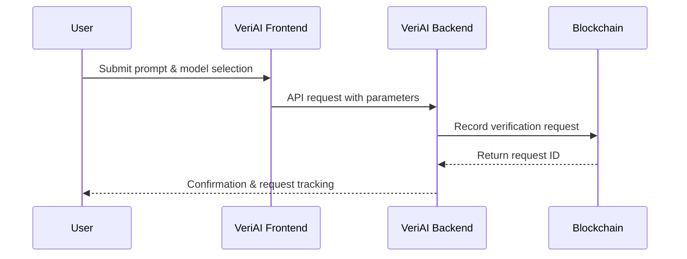
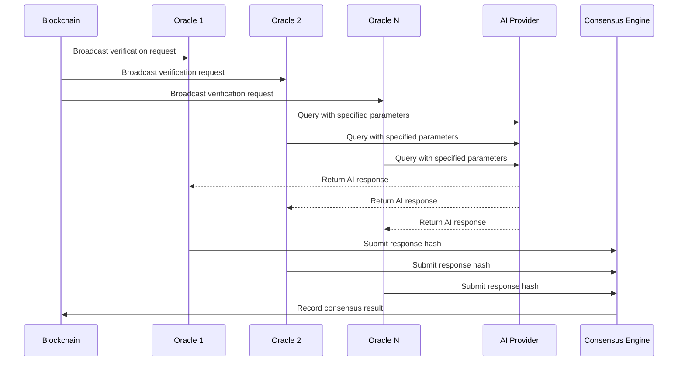

# How VeriAI Works: Technical Overview

## Executive Summary

VeriAI is a blockchain-based verification platform that provides cryptographic proof of AI-generated content authenticity. By leveraging decentralized oracle networks and NFT technology, VeriAI creates immutable certificates that verify the provenance, integrity, and authenticity of AI-generated content.

## The Problem Statement

In an era where AI-generated content is increasingly prevalent, organizations and individuals face critical challenges:

- **Authenticity Verification**: Difficulty proving that content was actually generated by a specific AI model
- **Content Integrity**: No reliable method to verify that AI-generated content hasn't been modified post-generation
- **Provenance Tracking**: Inability to demonstrate the original prompts and parameters used for content generation
- **Trust Deficit**: Lack of standardized verification mechanisms for AI-assisted work

## Solution Architecture

VeriAI addresses these challenges through a three-tier verification system:

### 1. **Blockchain-Backed Request Registration**

- All verification requests are immutably recorded on the Flare blockchain
- Each request receives a unique cryptographic identifier
- Timestamp and user attribution are permanently preserved

### 2. **Decentralized Oracle Consensus**

- Multiple independent oracles simultaneously query the specified AI model
- Consensus mechanisms ensure result authenticity through majority agreement
- Byzantine fault tolerance protects against malicious or erroneous responses

### 3. **NFT Certificate Generation**

- Successful verifications generate unique ERC-721 compliant NFT certificates
- Each certificate contains comprehensive metadata about the verification process
- Certificates serve as portable, verifiable proof of content authenticity

## Technical Implementation

### Phase 1: Content Generation Request



**Process Details:**

1. User submits content generation request through VeriAI interface
2. System validates input parameters and calculates verification fee
3. Request is cryptographically signed and recorded on blockchain
4. Unique request identifier is generated for tracking purposes

### Phase 2: Decentralized Verification



**Consensus Mechanism:**

- **Threshold**: Minimum 67% oracle agreement required for verification
- **Timeout**: 300-second maximum response window
- **Validation**: Cryptographic hash comparison ensures response integrity
- **Slashing**: Malicious oracles face economic penalties

### Phase 3: Certificate Generation

Upon successful consensus, the system:

1. **Generates Content Hash**: SHA-256 hash of the verified AI response
2. **Creates Metadata Structure**: Comprehensive verification details
3. **Mints NFT Certificate**: ERC-721 token with embedded metadata
4. **Transfers Certificate**: NFT sent to requester's wallet address

## NFT Certificate Structure

Each VeriAI certificate contains the following immutable metadata:

```json
{
  "requestId": "0x7d1a...",
  "prompt": "Original user prompt",
  "model": "AI model identifier",
  "timestamp": "ISO 8601 timestamp",
  "contentHash": "SHA-256 hash of AI response",
  "verificationProof": {
    "consensusHash": "0x9f2b...",
    "oracleCount": 5,
    "agreementThreshold": "67%",
    "verificationTime": "2025-09-06T10:30:00Z"
  },
  "blockchain": {
    "network": "Flare",
    "blockNumber": 12345678,
    "transactionHash": "0x8e3c..."
  }
}
```

## Enterprise Applications

### Academic Institutions

**Challenge**: Ensuring academic integrity in AI-assisted work
**Solution**:

- Students generate verified certificates for AI-assisted assignments
- Professors can instantly verify authenticity through blockchain records
- Institutional policies can reference VeriAI certificates as proof of legitimate AI usage

**Implementation Example**:

```typescript
// Student workflow
const verificationRequest = await veriAI.requestVerification({
  prompt: "Analyze the themes in Shakespeare's Hamlet",
  model: "gpt-4",
  academicContext: {
    institution: "University Name",
    course: "ENG 301",
    assignment: "Literary Analysis Paper",
  },
});
```

### Content Creation Industry

**Challenge**: Proving originality and authenticity of AI-assisted creative work
**Solution**:

- Content creators establish verifiable timestamps for AI-generated material
- Clients receive cryptographic proof of content authenticity
- Copyright disputes can reference blockchain-verified creation records

### Regulatory Compliance

**Challenge**: Meeting audit requirements for AI-generated business content
**Solution**:

- Companies maintain immutable records of AI usage in reporting
- Regulatory bodies can independently verify AI-generated compliance documents
- Audit trails demonstrate transparency in AI-assisted decision making

## Technical Specifications

### Supported AI Models

| Provider  | Models                   | API Version | Verification Support |
| --------- | ------------------------ | ----------- | -------------------- |
| OpenAI    | GPT-4, GPT-3.5-turbo     | v1          | ✅ Full              |
| Google    | Gemini Pro, Gemini Ultra | v1          | ✅ Full              |
| Anthropic | Claude 3 Opus, Sonnet    | v1          | ✅ Full              |
| Groq      | Llama 3.1, Mixtral       | v1          | ✅ Full              |
| DeepSeek  | DeepSeek-V2              | v1          | ✅ Full              |

### Blockchain Networks

| Network  | Purpose                    | Transaction Fees | Finality    |
| -------- | -------------------------- | ---------------- | ----------- |
| Flare    | Primary verification       | ~$0.001          | 3-5 seconds |
| Solana   | High-throughput operations | ~$0.0001         | 1-2 seconds |
| Ethereum | Legacy support             | Variable         | 12+ seconds |

### Performance Metrics

- **Verification Time**: 30-90 seconds average
- **Oracle Response Time**: <30 seconds per oracle
- **Consensus Formation**: 10-15 seconds
- **NFT Minting**: 5-10 seconds
- **System Uptime**: 99.9% SLA target

## Security Framework

### Cryptographic Security

1. **Request Signing**: All requests signed with user's private key
2. **Content Hashing**: SHA-256 ensures content integrity
3. **Oracle Signatures**: Each oracle response cryptographically signed
4. **Merkle Proofs**: Batch verification for gas optimization

### Network Security

1. **DDoS Protection**: Rate limiting and traffic analysis
2. **API Security**: JWT authentication with refresh tokens
3. **Oracle Security**: Stake-based reputation system
4. **Smart Contract Security**: Formal verification and audit reports

### Privacy Considerations

- **Prompt Privacy**: Original prompts encrypted on-chain (optional)
- **Response Privacy**: Only content hashes stored publicly
- **User Privacy**: Wallet addresses pseudonymous by default
- **Data Retention**: User-controlled data persistence policies

## Economic Model

### Fee Structure

```
Base Fee: $1.00 USD equivalent in SOL
├── Oracle Network: 60% ($0.60)
├── Protocol Treasury: 25% ($0.25)
├── NFT Minting: 10% ($0.10)
└── Network Fees: 5% ($0.05)
```

### Dynamic Pricing

- **SOL/USD Oracle**: Real-time price feeds from Flare Data Connector
- **Fee Adjustment**: Automatic recalculation every 15 minutes
- **Volume Discounts**: Reduced fees for high-volume users
- **Enterprise Pricing**: Custom pricing for institutional clients

## Integration Capabilities

### REST API

```typescript
// Request verification
POST /api/v1/verification/request
{
  "prompt": "string",
  "model": "string",
  "metadata": object
}

// Check status
GET /api/v1/verification/{requestId}/status

// Retrieve certificate
GET /api/v1/verification/{requestId}/certificate
```

### WebSocket API

```typescript
// Real-time updates
socket.on("verification-status", (data) => {
  console.log(`Status: ${data.status}`);
  console.log(`Progress: ${data.progress}%`);
});
```

### SDK Support

- **JavaScript/TypeScript**: `@veriai/sdk`
- **Python**: `veriai-python`
- **Go**: `veriai-go`
- **Rust**: `veriai-rs`

## Comparison with Alternative Solutions

| Feature             | VeriAI | Traditional Timestamping | Content Hashing | AI Provider Logs |
| ------------------- | ------ | ------------------------ | --------------- | ---------------- |
| Decentralized       | ✅     | ❌                       | ❌              | ❌               |
| AI-Specific         | ✅     | ❌                       | ❌              | ✅               |
| Tamper-Proof        | ✅     | ✅                       | ⚠️              | ❌               |
| Public Verification | ✅     | ⚠️                       | ⚠️              | ❌               |
| NFT Certificates    | ✅     | ❌                       | ❌              | ❌               |
| Oracle Consensus    | ✅     | ❌                       | ❌              | ❌               |

## Future Developments

### Roadmap Q4 2025

- **Advanced Analytics**: ML-powered verification insights
- **Cross-Chain Expansion**: Support for additional blockchain networks
- **Enterprise Dashboard**: Comprehensive management interface
- **API Rate Limiting**: Tiered access controls

### Research & Development

- **Zero-Knowledge Proofs**: Enhanced privacy for sensitive prompts
- **Federated Learning**: Collaborative oracle training
- **Quantum Resistance**: Post-quantum cryptographic algorithms
- **Edge Computing**: Distributed verification nodes

## Conclusion

VeriAI represents a paradigm shift in AI content verification, providing unprecedented transparency and trust in an increasingly AI-driven world. By combining blockchain immutability, oracle consensus mechanisms, and NFT technology, VeriAI creates a robust foundation for the next generation of AI accountability systems.

The platform's technical architecture ensures scalability, security, and interoperability while maintaining user privacy and system performance. As AI continues to transform industries, VeriAI provides the verification infrastructure necessary to maintain trust, compliance, and authenticity in AI-generated content.

---

_For technical support, integration assistance, or enterprise inquiries, contact the VeriAI development team at [technical@veriai.com](mailto:technical@veriai.com)_
