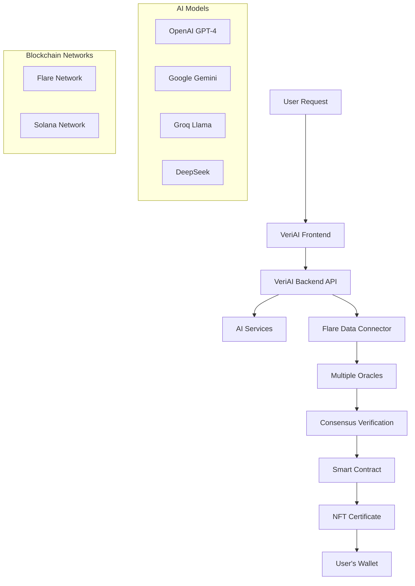

# VeriAI 🤖🔐

**Decentralized AI Content Verification with Blockchain-Backed Certificates**

VeriAI is a revolutionary platform that provides cryptographic proof and NFT certificates for AI-generated content using Flare Data Connector (FDC) oracles and Solana blockchain integration. Built for the era of AI transparency, VeriAI ensures trust, authenticity, and verifiability in AI-generated content.

## 🌟 Overview

VeriAI solves the critical problem of AI content verification by creating immutable, blockchain-backed certificates for AI-generated content. When you generate content through VeriAI, multiple independent oracles verify the AI response and create an NFT certificate that proves:

- ✅ **Authenticity**: Content was actually generated by a specific AI model
- ✅ **Integrity**: Content hasn't been tampered with since creation
- ✅ **Provenance**: Original prompt and AI model used are verifiable
- ✅ **Timestamping**: Exact time of generation is recorded
- ✅ **Consensus**: Multiple oracles verified the same result

## 🏗️ Architecture



## 🚀 Key Features

### 🔐 **Decentralized Verification**
- Multiple independent oracles verify AI responses
- Consensus-based validation ensures authenticity
- No single point of failure or trust

### 🏆 **NFT Certificates**
- Unique NFT for each verified AI generation
- Immutable proof stored on blockchain
- Collectible portfolio of AI interactions

### 🤖 **Multi-AI Support**
- OpenAI GPT-4 and GPT-3.5
- Google Gemini Pro
- Groq Llama models
- DeepSeek AI
- Extensible to more AI providers

### 💰 **Dynamic Pricing**
- SOL/USD price oracle integration
- Fixed $1 USD equivalent pricing
- Automatic fee calculation in real-time

### 📊 **Comprehensive Analytics**
- User verification history
- Success/failure rate tracking
- AI model performance metrics
- Portfolio management

### ⚡ **Real-time Updates**
- WebSocket integration for live status
- Instant verification notifications
- Progress tracking for long requests

## 🛠️ Tech Stack

### **Frontend**
- **Framework**: Next.js 15 with React 19
- **Styling**: Tailwind CSS + Radix UI
- **Wallet Integration**: Web3Auth (Multi-chain)
- **State Management**: TanStack Query
- **Real-time**: Socket.io Client
- **Blockchain**: Wagmi + Viem (Ethereum), Solana Web3.js

### **Backend**
- **Runtime**: Node.js with TypeScript
- **Framework**: Express.js
- **Database**: MongoDB with Mongoose
- **Authentication**: JWT + Web3 signatures
- **Real-time**: Socket.io
- **Documentation**: Swagger/OpenAPI
- **Security**: Helmet, CORS, Rate limiting

### **Smart Contracts**
- **Solidity**: For Ethereum-compatible chains (Flare)
- **Solang**: For Solana deployment
- **Oracles**: Flare Data Connector (FDC)
- **Standards**: ERC-721 for NFTs

### **Infrastructure**
- **Cloud**: Google Cloud Run
- **CI/CD**: Cloud Build
- **Secrets**: Google Secret Manager
- **Monitoring**: Winston logging
- **Deployment**: Docker containers

## 📁 Project Structure

```
veriai/
├── 📱 frontend/                    # Next.js frontend application
│   ├── app/                       # App Router pages
│   │   ├── dashboard/             # User dashboard
│   │   ├── verify/                # Verification interface
│   │   ├── marketplace/           # NFT marketplace
│   │   └── analytics/             # Analytics dashboard
│   ├── components/                # Reusable components
│   │   ├── ui/                    # Base UI components
│   │   ├── features/              # Feature-specific components
│   │   ├── layout/                # Layout components
│   │   └── providers/             # Context providers
│   └── hooks/                     # Custom React hooks
│
├── 🔧 backend/                     # Express.js API server
│   ├── src/
│   │   ├── controllers/           # API route handlers
│   │   ├── services/              # Business logic
│   │   ├── models/                # Database models
│   │   ├── routes/                # API routes
│   │   ├── middleware/            # Express middleware
│   │   └── utils/                 # Utility functions
│   └── deploy.sh                  # Cloud deployment script
│
├── 📜 contracts/                   # Smart contracts
│   ├── contracts/                 # Solidity contracts
│   │   ├── VeriAISolana.sol      # Main verification contract
│   │   ├── VeriAINFTSolana.sol   # NFT certificate contract
│   │   └── SolanaOracleRelayer.sol # Oracle integration
│   ├── interfaces/                # Contract interfaces
│   ├── libraries/                 # Shared libraries
│   └── scripts/                   # Deployment scripts
│
└── 📚 documentation/              # Project documentation
    ├── howitworks.md              # How VeriAI works
    └── README.md                  # This file
```

## 🚀 Quick Start

### Prerequisites

- Node.js 18+ 
- Docker (for deployment)
- MongoDB instance
- Google Cloud account (for deployment)
- Web3 wallet (MetaMask, etc.)

### 1. Clone the Repository

```bash
git clone https://github.com/BenStacks/veriai.git
cd veriai
```

### 2. Backend Setup

```bash
cd backend

# Install dependencies
npm install

# Copy environment template
cp .env.example .env

# Edit .env with your configuration
nano .env
```

**Required Environment Variables:**

```env
# Database
MONGODB_URI=mongodb://localhost:27017/veriai

# AI API Keys
OPENAI_API_KEY=your_openai_key
GEMINI_API_KEY=your_gemini_key
GROQ_API_KEY=your_groq_key
DEEPSEEK_API_KEY=your_deepseek_key

# Blockchain
PRIVATE_KEY=your_private_key
VERI_AI_CONTRACT_ADDRESS=contract_address
FDC_ORACLE_ADDRESS=oracle_address

# Security
JWT_SECRET=your_jwt_secret

# Server
PORT=3001
NODE_ENV=development
CORS_ORIGIN=http://localhost:3000
```

```bash
# Start development server
npm run dev
```

### 3. Frontend Setup

```bash
cd frontend

# Install dependencies
npm install

# Copy environment template
cp .env.local.example .env.local

# Edit .env.local with your configuration
nano .env.local
```

**Frontend Environment Variables:**

```env
NEXT_PUBLIC_API_URL=http://localhost:3001
NEXT_PUBLIC_WEB3AUTH_CLIENT_ID=your_web3auth_client_id
NEXT_PUBLIC_FLARE_RPC_URL=https://flare-api.flare.network/ext/C/rpc
NEXT_PUBLIC_SOLANA_RPC_URL=https://api.mainnet-beta.solana.com
```

```bash
# Start development server
npm run dev
```

### 4. Access the Application

- **Frontend**: http://localhost:3000
- **Backend API**: http://localhost:3001
- **API Documentation**: http://localhost:3001/api-docs

## 🔧 Development

### Running Tests

```bash
# Backend tests
cd backend
npm test

# Frontend tests
cd frontend
npm test
```

### Code Quality

```bash
# Linting
npm run lint

# Type checking
npm run type-check

# Auto-fix issues
npm run lint:fix
```

### Database Operations

```bash
# Connect to MongoDB
mongosh "mongodb://localhost:27017/veriai"

# View collections
show collections

# Query verifications
db.verifications.find().pretty()
```

## 🚢 Deployment

### Cloud Deployment (Google Cloud Run)

```bash
cd backend

# Set your project ID
export PROJECT_ID="your-gcp-project-id"

# Make deployment script executable
chmod +x deploy.sh

# Deploy to Cloud Run
./deploy.sh
```

The deployment script automatically:
- ✅ Builds Docker image
- ✅ Uploads secrets to Secret Manager
- ✅ Deploys to Cloud Run
- ✅ Configures auto-scaling
- ✅ Sets up health checks

### Frontend Deployment (Vercel)

```bash
cd frontend

# Install Vercel CLI
npm i -g vercel

# Deploy
vercel --prod
```

### Smart Contract Deployment

```bash
cd contracts

# Install dependencies
npm install

# Compile contracts
npx hardhat compile

# Deploy to Flare Network
npx hardhat run scripts/deploy.js --network flare

# Deploy to Solana (using Solang)
./deploy-with-solang.sh
```

## 📊 API Documentation

### Core Endpoints

#### POST `/api/verification/request`
Request AI content verification

```json
{
  "prompt": "Write a poem about blockchain",
  "model": "gpt-4",
  "requester": "0x..."
}
```

#### GET `/api/verification/:requestId`
Get verification status

```json
{
  "requestId": "0x...",
  "status": "verified",
  "outputHash": "0x...",
  "nftTokenId": 123
}
```

#### GET `/api/user/:address/verifications`
Get user's verification history

#### POST `/api/ai/generate`
Direct AI generation with verification

### WebSocket Events

```typescript
// Subscribe to verification updates
socket.emit('subscribe-verification', requestId);

// Listen for status updates
socket.on('verification-status', (data) => {
  console.log('Status:', data.status);
});
```

## 🎯 Use Cases

### 👩‍🎓 **Academic Integrity**
- Students prove AI assistance was used legitimately
- Teachers verify authenticity of AI-generated content
- Academic institutions maintain transparent AI policies

### 📝 **Content Creation**
- Writers establish copyright for AI-assisted content
- Publishers verify content authenticity
- Content creators build portfolios of AI collaborations

### 💼 **Business & Legal**
- Companies prove AI-generated reports are unmodified
- Legal professionals use certified AI analysis
- Compliance teams maintain audit trails

### 🎨 **Creative Industries**
- Artists showcase AI collaboration process
- Musicians prove authentic AI composition
- Designers demonstrate creative AI workflows

### 🔬 **Research & Development**
- Researchers document AI experiment results
- Scientists verify AI-assisted analysis
- Data analysts prove methodology transparency

## 🔐 Security Features

### **Cryptographic Verification**
- SHA-256 hashing for content integrity
- Elliptic curve signatures for authentication
- Merkle tree proofs for batch verification

### **Oracle Security**
- Multiple independent oracle consensus
- Byzantine fault tolerance
- Stake-based oracle reputation

### **Smart Contract Security**
- Reentrancy protection
- Access control mechanisms
- Emergency pause functionality
- Upgrade proxy patterns

### **API Security**
- JWT authentication
- Rate limiting per user
- Request validation
- CORS protection
- Helmet security headers

## 📈 Roadmap

### **Phase 1: Core Platform** ✅
- [x] Basic verification system
- [x] NFT certificate generation
- [x] Multi-AI integration
- [x] Web3 wallet connection

### **Phase 2: Oracle Integration** ✅
- [x] Flare Data Connector integration
- [x] Multiple oracle consensus
- [x] Dynamic pricing with SOL/USD oracle
- [x] Solana blockchain support

### **Phase 3: Enhanced Features** 🚧
- [ ] Advanced analytics dashboard
- [ ] NFT marketplace integration
- [ ] Batch verification processing
- [ ] API key management

### **Phase 4: Enterprise** 📋
- [ ] Enterprise API access
- [ ] Custom verification workflows
- [ ] White-label solutions
- [ ] SLA guarantees

### **Phase 5: Ecosystem** 🔮
- [ ] Third-party integrations
- [ ] Plugin architecture
- [ ] Community governance
- [ ] Cross-chain expansion

## 🤝 Contributing

We welcome contributions! Please see our [Contributing Guide](CONTRIBUTING.md) for details.

### Development Setup

1. Fork the repository
2. Create a feature branch
3. Make your changes
4. Add tests
5. Submit a pull request

### Code Style

- TypeScript for all new code
- ESLint + Prettier for formatting
- Conventional commit messages
- 100% test coverage for new features

## 📄 License

This project is licensed under the MIT License - see the [LICENSE](LICENSE) file for details.

## 🆘 Support

### Documentation
- [How VeriAI Works](howitworks.md) - Detailed explanation
- [API Documentation](https://api.veriai.com/docs) - Interactive API docs
- [Smart Contract Docs](contracts/README.md) - Contract documentation

### Community
- [Discord](https://discord.gg/veriai) - Community chat
- [Twitter](https://twitter.com/veriai) - Updates and news
- [GitHub Issues](https://github.com/BenStacks/veriai/issues) - Bug reports

### Enterprise
- [Contact Sales](mailto:sales@veriai.com) - Enterprise solutions
- [Support Portal](https://support.veriai.com) - Technical support
- [Status Page](https://status.veriai.com) - Service status

## 🙏 Acknowledgments

- [Flare Network](https://flare.network/) - Oracle infrastructure
- [Solana](https://solana.com/) - High-performance blockchain
- [OpenAI](https://openai.com/) - AI model access
- [Web3Auth](https://web3auth.io/) - Wallet infrastructure
- [Vercel](https://vercel.com/) - Frontend hosting
- [Google Cloud](https://cloud.google.com/) - Backend infrastructure

---

**Built with ❤️ by the VeriAI Team**

*Making AI content trustworthy, one verification at a time.*

[](https://deploy.cloud.run)
[](https://vercel.com/new/clone?repository-url=https://github.com/BenStacks/veriai)
