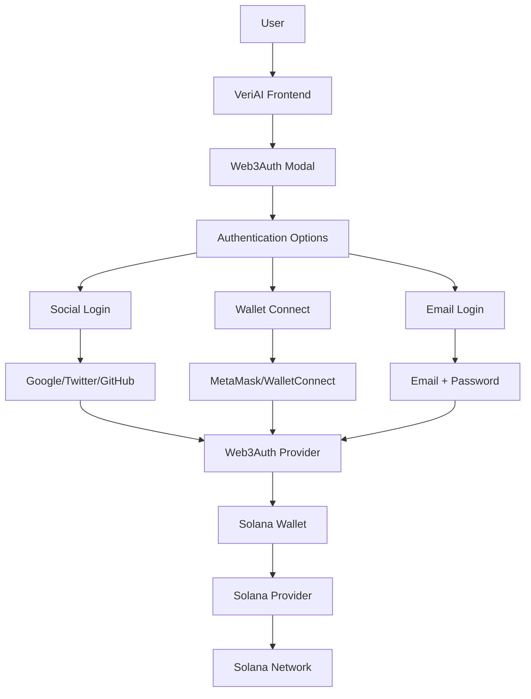

# Web3Auth Integration in VeriAI 🔐

## Overview

VeriAI leverages **Web3Auth** to provide seamless, secure, and user-friendly wallet authentication for the Solana blockchain. This integration enables users to connect without complex wallet setup while maintaining full access to Solana's high-performance network.

## Integration Architecture



## Implementation Details

### 1. **Web3Auth Configuration**

```typescript
// lib/web3auth/config.ts
import { Web3AuthModal } from "@web3auth/modal";
import { EthereumPrivateKeyProvider } from "@web3auth/ethereum-provider";
import { SolanaPrivateKeyProvider } from "@web3auth/solana-provider";

const clientId = process.env.NEXT_PUBLIC_WEB3AUTH_CLIENT_ID;

export const web3AuthConfig = {
  clientId,
  chainConfig: {
    chainNamespace: "solana", // For Solana network
    chainId: "0x1", // Solana Mainnet
    rpcTarget: "https://api.mainnet-beta.solana.com",
    displayName: "Solana Network",
    blockExplorer: "https://explorer.solana.com/",
    ticker: "SOL",
    tickerName: "Solana",
  },
  uiConfig: {
    theme: "dark",
    loginMethodsOrder: ["google", "github", "twitter", "email_passwordless"],
    appLogo: "https://veriai.vercel.app/logo.png",
  },
};
```

### 2. **Multi-Chain Provider Setup**

````typescript
### 2. **Solana Provider Setup**

```typescript
// hooks/use-web3auth-solana.ts
export const useWeb3AuthSolana = () => {
  const [web3auth, setWeb3auth] = useState<Web3AuthModal | null>(null);
  const [solanaProvider, setSolanaProvider] = useState(null);

  const initializeProvider = async () => {
    // Solana Provider
    const solanaProvider = new SolanaPrivateKeyProvider({
      config: { chainConfig: solanaChainConfig }
    });

    await solanaProvider.setupProvider(web3auth.provider);
    setSolanaProvider(solanaProvider);
  };

  return {
    solana: {
      provider: solanaProvider,
      address: solanaAddress,
      balance: solanaBalance,
    },
  };
};
````

### 3. **Authentication Flow**

```typescript
// components/providers/veriAIWeb3AuthProvider.tsx
export const VeriAIWeb3AuthProvider = ({ children }) => {
  const [user, setUser] = useState(null);
  const [isConnected, setIsConnected] = useState(false);

  const connectWallet = async () => {
    try {
      const web3authProvider = await web3auth.connect();
      const userInfo = await web3auth.getUserInfo();

      // Get Solana address
      const solAddress = await getSolanaAddress(web3authProvider);

      setUser({
        ...userInfo,
        address: solAddress,
      });
      setIsConnected(true);
    } catch (error) {
      console.error("Connection failed:", error);
    }
  };

  return (
    <Web3AuthContext.Provider
      value={{
        user,
        isConnected,
        connectWallet,
        disconnectWallet,
      }}
    >
      {children}
    </Web3AuthContext.Provider>
  );
};
```

## Key Features Enabled by Web3Auth

### 🔑 **Social Login Integration**

- **Google OAuth**: Seamless Google account integration
- **GitHub**: Developer-friendly authentication
- **Twitter**: Social media integration
- **Email**: Passwordless email authentication

### 🔗 **Multi-Chain Support**

- **Flare Network**: For oracle interactions and verification contracts
- **Solana**: For NFT minting and marketplace transactions
- **Unified Interface**: Single login for multiple chains

### 👤 **User Experience Features**

- **No Seed Phrases**: Users don't need to manage complex wallet keys
- **Social Recovery**: Account recovery through social login
- **Progressive Web App**: Works seamlessly on mobile and desktop
- **White-label**: Customized UI matching VeriAI branding

## Security Implementation

### 1. **Private Key Management**

```typescript
// Web3Auth handles private key generation and management
const getPrivateKey = async () => {
  const privateKey = await web3auth.provider.request({
    method: "eth_private_key",
  });
  // Private key is encrypted and managed by Web3Auth
  return privateKey;
};
```

### 2. **Transaction Signing**

```typescript
// Secure transaction signing for both chains
const signEthereumTransaction = async (txData) => {
  const web3 = new Web3(ethereumProvider);
  const tx = await web3.eth.sendTransaction(txData);
  return tx;
};

const signSolanaTransaction = async (transaction) => {
  const connection = new Connection(solanaRPC);
  const signature = await solanaProvider.signAndSendTransaction(transaction);
  return signature;
};
```

### 3. **JWT Token Management**

```typescript
// Secure API authentication
const generateAuthToken = async () => {
  const userInfo = await web3auth.getUserInfo();
  const signature = await signMessage("VeriAI Auth Token");

  return jwt.sign(
    {
      userId: userInfo.verifierId,
      address: userInfo.address,
      signature,
      timestamp: Date.now(),
    },
    JWT_SECRET
  );
};
```

## Integration Benefits for VeriAI

### ✅ **User Onboarding**

- Reduces friction for non-crypto users
- Familiar login methods (Google, email)
- No complex wallet setup required

### ✅ **Multi-Chain Operations**

- Single login for Flare and Solana
- Seamless cross-chain transactions
- Unified user experience

### ✅ **Enterprise Ready**

- OAuth compliance for enterprise users
- SSO integration capabilities
- Audit-friendly authentication logs

### ✅ **Developer Experience**

- Well-documented APIs
- TypeScript support
- React hooks for easy integration

## Code Examples

### Connect Wallet Button

```tsx
import { useVeriAIAuth } from "@/hooks/useVeriAIAuth";

const WalletButton = () => {
  const { isConnected, user, connectWallet, disconnectWallet } =
    useVeriAIAuth();

  return (
    <Button onClick={isConnected ? disconnectWallet : connectWallet}>
      {isConnected ? `${user.email} (Connected)` : "Connect Wallet"}
    </Button>
  );
};
```

### Transaction Execution

```tsx
const executeVerification = async (prompt: string, model: string) => {
  const { ethereum, solana } = useWeb3AuthMultichain();

  // Pay verification fee on Solana
  const paymentTx = await solana.sendTransaction({
    to: TREASURY_ADDRESS,
    value: verificationFee,
  });

  // Execute verification on Flare
  const verificationTx = await ethereum.contract.requestVerification(
    prompt,
    model,
    { gasLimit: 300000 }
  );

  return { paymentTx, verificationTx };
};
```

## Testing & Debugging

### Development Setup

```bash
# Install Web3Auth dependencies
npm install @web3auth/modal @web3auth/ethereum-provider @web3auth/solana-provider

# Set environment variables
NEXT_PUBLIC_WEB3AUTH_CLIENT_ID=your_client_id
NEXT_PUBLIC_WEB3AUTH_NETWORK=sapphire_devnet # for testing
```

### Testing Scenarios

1. **Social Login**: Test Google/GitHub OAuth flow
2. **Multi-Chain**: Verify both Ethereum and Solana address generation
3. **Transaction Signing**: Test on both testnets
4. **Error Handling**: Test network failures and recovery

## Production Considerations

### Security Checklist

- ✅ Client ID properly configured
- ✅ HTTPS enforcement
- ✅ CSP headers configured
- ✅ Rate limiting implemented
- ✅ Error logging configured

### Performance Optimization

- ✅ Lazy load Web3Auth modal
- ✅ Cache provider instances
- ✅ Optimize bundle size
- ✅ Implement connection pooling

---

_Web3Auth Integration completed: September 2025_
_For integration support: [Web3Auth Documentation](https://web3auth.io/docs/)_
